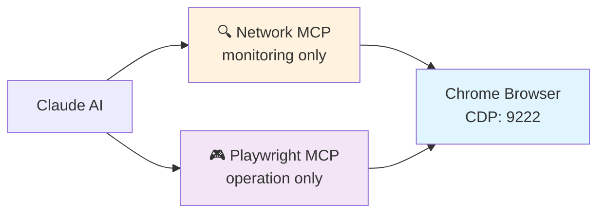
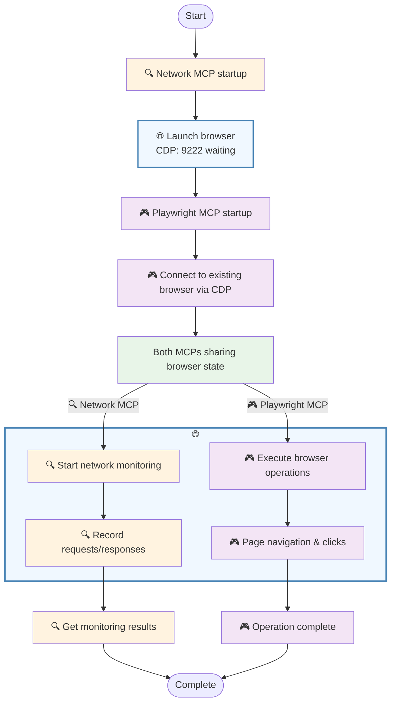

# playwright-min-network-mcp

A minimal network monitoring MCP tool for Playwright browser automation. Just 5 simple tools to capture, filter, and analyze network traffic during web automation with MCP context efficiency.





## Features

- **📡 Network Capture**: Real-time request/response monitoring via Chrome DevTools Protocol
- **🔍 Smart Filtering**: Content-type, URL patterns, and HTTP method filtering
- **⚡ MCP Context Safe**: 512B previews + 50KB detail limits prevent token overflow
- **🔄 Dynamic Updates**: Change filters without browser restart
- **🤝 Playwright Integration**: Works seamlessly with Playwright MCP

## Prerequisites

### 1. Install Playwright
This tool requires Playwright to be installed for browser automation:

```bash
npm install playwright
# Install browser binaries
npx playwright install chromium
```

### 2. Install Network Monitor MCP
```bash
npm install playwright-min-network-mcp
```

## Quick Start

### Basic MCP Configuration

Add to your `.mcp.json`:

```json
{
  "mcpServers": {
    "network-monitor": {
      "command": "npx",
      "args": ["playwright-min-network-mcp"]
    }
  }
}
```

### Combined with Playwright MCP

```json
{
  "mcpServers": {
    "network-monitor": {
      "command": "npx",
      "args": ["playwright-min-network-mcp"]
    },
    "playwright": {
      "command": "npx",
      "args": ["@playwright/mcp", "--cdp-endpoint", "http://localhost:9222"]
    }
  }
}
```

## Usage Examples

### Basic Workflow

```json
// 1. Start monitoring (launches visible Chrome browser)
{
  "tool": "start_monitor"
}

// 2. Use Playwright MCP to interact with web pages
// The browser will automatically connect to the same CDP endpoint

// 3. Retrieve captured network requests (compact overview with 512B previews)
{
  "tool": "get_recent_requests",
  "arguments": {
    "count": 50
  }
}

// 4. Get detailed request info by UUID (limited to 50KB, headers optional)
{
  "tool": "get_request_detail",
  "arguments": {
    "uuid": "123e4567-e89b-12d3-a456-426614174000",
    "include_headers": false
  }
}

// 5. Stop monitoring when done
{
  "tool": "stop_monitor"
}
```

### Filtering Examples

```json
// Include everything (CSS, JS, images, etc.)
{"tool": "start_monitor", "arguments": {"filter": {"content_types": "all"}}}

// Custom content types  
{"tool": "start_monitor", "arguments": {"filter": {"content_types": ["application/json", "text/css"]}}}

// Update filters without restarting browser
{"tool": "update_filter", "arguments": {"filter": {"content_types": ["application/json"], "url_include_patterns": ["api/"], "methods": ["POST"]}}}
```

## API Reference

### Tools

- **start_monitor**: Launch browser and start monitoring
- **update_filter**: Change filters without browser restart  
- **stop_monitor**: Stop monitoring
- **get_recent_requests**: Get compact overview with 512B previews
- **get_request_detail**: Get full details by UUID (50KB limit)


## Default Filtering

Captures API and form data by default:
- `application/json`, `application/x-www-form-urlencoded`, `multipart/form-data`, `text/plain`
- Excludes CSS, JS, images (use `content_types: "all"` to include)

## Output Format

**Compact overview** (get_recent_requests) with 512B request/response body previews:

```json
{
  "total_captured": 156,
  "showing": 30,
  "requests": [
    {
      "uuid": "123e4567-e89b-12d3-a456-426614174000",
      "method": "POST",
      "status": 200,
      "url": "https://api.github.com/graphql",
      "mimeType": "application/json",
      "requestBodyPreview": "{\"query\": \"query GetRepository...",
      "requestBodySize": 2048,
      "responseBodyPreview": "{\"data\": {\"repository\": {...",
      "responseBodySize": 4096,
      "timestamp": 1641472496000,
      "responseTimestamp": 1641472496123
    }
  ]
}
```

**Full request details** (via `get_request_detail` with UUID, limited to 50KB):

```json
{
  "id": "request-123",
  "uuid": "123e4567-e89b-12d3-a456-426614174000",
  "url": "https://api.github.com/graphql",
  "method": "POST",
  "headers": undefined,
  "timestamp": 1641472496000,
  "type": "request",
  "body": "{\"query\": \"query GetRepository($owner: String!, $name: String!) { ... }\"}",
  "response": {
    "status": 200,
    "headers": undefined,
    "mimeType": "application/json",
    "body": "{\"data\": {\"repository\": {...}}} \n... [truncated from 67647 bytes]"
  },
  "responseTimestamp": 1641472496123
}
```


## Requirements

- Node.js ≥18.0.0
- Playwright (`npm install playwright && npx playwright install chromium`)

## Development

```bash
# Clone and install
git clone https://github.com/bun913/playwright-min-network-mcp.git
cd playwright-min-network-mcp
npm install

# Build
npm run build

# Test
npm run test:ci

# Development mode
npm run dev

# Debug with MCP Inspector
npm run debug
```

## License

MIT License - see [LICENSE](LICENSE) file for details.