# playwright-min-network-mcp

A minimal network monitoring MCP tool for Playwright browser automation. **Just 4 simple tools** to capture, filter, and analyze network traffic during web automation with MCP context efficiency.

```mermaid
graph LR
    A[Claude AI] --> B[🔍 Network MCP<br/>monitoring only]
    A --> C[🎮 Playwright MCP<br/>operation only]
    
    B --> D[Chrome Browser<br/>CDP: 9222]
    C --> D
    
    style B fill:#fff3e0
    style C fill:#f3e5f5
    style D fill:#e1f5fe
```

```mermaid
flowchart TD
    Start([Start]) --> A[🔍 Network MCP startup]
    A --> B[🌐 Launch browser<br/>CDP: 9222 waiting]
    B --> C[🎮 Playwright MCP startup]
    C --> D[🎮 Connect to existing browser via CDP]
    D --> E[Both MCPs sharing browser state]
    
    E -->|🔍 Network MCP| F[🔍 Start network monitoring]
    E -->|🎮 Playwright MCP| G[🎮 Execute browser operations]
    
    subgraph Browser["🌐"]
        F --> H[🔍 Record requests/responses]
        G --> I[🎮 Page navigation & clicks]
    end
    
    H --> J[🔍 Get monitoring results]
    I --> K[🎮 Operation complete]
    J --> End([Complete])
    K --> End
    
    style A fill:#fff3e0
    style B fill:#f0f8ff,stroke:#4682b4,stroke-width:2px
    style C fill:#f3e5f5
    style D fill:#f3e5f5
    style E fill:#e8f5e8
    style Browser fill:#f0f8ff,stroke:#4682b4,stroke-width:3px
    style F fill:#fff3e0
    style G fill:#f3e5f5
    style H fill:#fff3e0
    style I fill:#f3e5f5
    style J fill:#fff3e0
    style K fill:#f3e5f5
```





## Features

- **🎯 Minimal Design**: Only 4 tools (`start_or_update_capture`, `stop_monitor`, `get_recent_requests`, `get_request_detail`) - no complexity
- **📡 Network Capture**: Real-time request/response monitoring via Chrome DevTools Protocol
- **🔍 Smart Filtering**: URL include patterns, content-type, and HTTP method filtering for targeted monitoring
- **⚡ MCP Context Efficiency**: 512B body previews + 50KB detail limits prevent context overflow
- **🛡️ Safe Scaling**: Handles large responses (67KB+) without MCP token limit violations
- **🔄 Dynamic Updates**: Re-run start_or_update_capture to update filters
- **🤝 Playwright Integration**: Works seamlessly with Playwright MCP during automation

## Prerequisites

### 1. Install Playwright
This tool requires Playwright to be installed for browser automation:

```bash
npm install playwright
# Install browser binaries
npx playwright install chromium
```

### 2. Install Network Monitor MCP
```bash
npm install playwright-min-network-mcp
```

## Why This Tool?

**🎯 Minimal by Design**: Just 4 tools to capture and analyze network traffic during Playwright automation:
- **Simple**: `start_or_update_capture` → `get_recent_requests` → `get_request_detail` → `stop_monitor`
- **Context Safe**: 512B body previews + 50KB detail limits prevent MCP token overflow
- **Smart Filtering**: URL include patterns (`["api/", "/graphql"]`) for targeted monitoring
- **Dynamic**: Re-run `start_or_update_capture` with new settings to update filters
- **Zero config**: Works immediately with smart defaults
- **AI-friendly**: Perfect for MCP workflows and automation analysis

## Quick Start

### 1. Basic MCP Configuration

Add to your `.mcp.json`:

```json
{
  "mcpServers": {
    "network-monitor": {
      "command": "npx",
      "args": ["playwright-min-network-mcp"]
    }
  }
}
```

### 2. Combined with Playwright MCP

For comprehensive browser automation + network monitoring:

```json
{
  "mcpServers": {
    "network-monitor": {
      "command": "npx",
      "args": ["playwright-min-network-mcp"]
    },
    "playwright": {
      "command": "npx",
      "args": ["@playwright/mcp", "--cdp-endpoint", "http://localhost:9222"]
    }
  }
}
```

## Usage Examples

### Basic Workflow

```json
// 1. Start monitoring (launches visible Chrome browser)
{
  "tool": "start_or_update_capture"
}

// 2. Use Playwright MCP to interact with web pages
// The browser will automatically connect to the same CDP endpoint

// 3. Retrieve captured network requests (compact overview with 512B previews)
{
  "tool": "get_recent_requests",
  "arguments": {
    "count": 50
  }
}

// 4. Get detailed request info by UUID (limited to 50KB, headers optional)
{
  "tool": "get_request_detail",
  "arguments": {
    "uuid": "123e4567-e89b-12d3-a456-426614174000",
    "include_headers": false
  }
}

// 5. Stop monitoring when done
{
  "tool": "stop_monitor"
}
```

### Content-Type Filtering

Control which types of network requests to capture:

```json
// Default: API and form data only
{
  "tool": "start_or_update_capture",
  "arguments": {
    "filter": {
      "content_types": [
        "application/json",
        "application/x-www-form-urlencoded", 
        "multipart/form-data",
        "text/plain"
      ]
    }
  }
}

// Include everything (CSS, JS, images, etc.)
{
  "tool": "start_or_update_capture",
  "arguments": {
    "filter": {
      "content_types": "all"
    }
  }
}

// Include nothing (disable monitoring)
{
  "tool": "start_or_update_capture",
  "arguments": {
    "filter": {
      "content_types": []
    }
  }
}

// Custom content types
{
  "tool": "start_or_update_capture",
  "arguments": {
    "filter": {
      "content_types": ["application/json", "application/xml"]
    }
  }
}
```

### URL Include Patterns and Method Filtering

```json
// URL include patterns and HTTP method filtering at capture time
{
  "tool": "start_or_update_capture",
  "arguments": {
    "filter": {
      "content_types": ["application/json"],
      "url_include_patterns": ["api/", "/graphql", "/v1/"],
      "methods": ["POST", "PUT", "DELETE"]
    }
  }
}

// Update filters by re-running with new settings
{
  "tool": "start_or_update_capture",
  "arguments": {
    "filter": {
      "content_types": ["application/json", "text/html"],
      "url_include_patterns": ["https://api.github.com/", "https://zenn.dev/api/"],
      "methods": ["GET", "POST"]
    }
  }
}
```

## API Reference

### start_or_update_capture

Start network capture or update filter settings with auto-launched browser.

| Parameter | Type | Default | Description |
|-----------|------|---------|-------------|
| `max_buffer_size` | number | 20 | Maximum number of requests to store in memory |
| `cdp_port` | number | 9222 | Chrome DevTools Protocol port number |
| `filter.content_types` | string[] \| "all" | `["application/json", ...]` | Content types to capture |
| `filter.url_include_patterns` | string[] \| "all" | `"all"` | URL patterns to include (e.g., `["api/", "/graphql"]`) |
| `filter.methods` | string[] | undefined | HTTP methods to include (e.g., `["GET", "POST"]`) |

### stop_monitor

Stop network monitoring and close CDP connections.

No parameters required.

### get_recent_requests

Retrieve captured network requests compact overview. **Always includes 512B body previews** for efficient request identification.

| Parameter | Type | Default | Description |
|-----------|------|---------|-------------|
| `count` | number | 10 | Number of requests to return |
| `include_headers` | boolean | false | Include request/response headers in output |

### get_request_detail

Get full details for a specific request by UUID. **Body limited to 50KB** to prevent MCP context overflow.

| Parameter | Type | Required | Description |
|-----------|------|----------|-------------|
| `uuid` | string | Yes | UUID v4 of the request to retrieve details for |
| `include_headers` | boolean | No (default: false) | Include request/response headers (excluded by default for context efficiency) |


## Default Filtering Behavior

**Smart Default Content Types:**
- `application/json` - API responses and AJAX calls
- `application/x-www-form-urlencoded` - HTML form submissions  
- `multipart/form-data` - File uploads and form data
- `text/plain` - Simple text data and analytics

**What gets captured by default:**
- ✅ GitHub API calls (`api.github.com`)
- ✅ GraphQL endpoints
- ✅ AWS S3 uploads (`*.amazonaws.com`)
- ✅ Form submissions and file uploads
- ✅ AJAX/XHR communications
- ❌ CSS, JavaScript, images (unless `content_types: "all"`)
- ❌ Analytics tracking (unless explicitly included)

## Output Format

**Compact overview** (get_recent_requests) with 512B body previews:

```json
{
  "total_captured": 156,
  "showing": 30,
  "requests": [
    {
      "uuid": "123e4567-e89b-12d3-a456-426614174000",
      "method": "POST",
      "status": 200,
      "url": "https://api.github.com/graphql",
      "mimeType": "application/json",
      "bodyPreview": "{\"query\": \"query GetRepository...",
      "bodySize": 2048,
      "timestamp": 1641472496000,
      "responseTimestamp": 1641472496123
    }
  ]
}
```

**Full request details** (via `get_request_detail` with UUID, limited to 50KB):

```json
{
  "id": "request-123",
  "uuid": "123e4567-e89b-12d3-a456-426614174000",
  "url": "https://api.github.com/graphql",
  "method": "POST",
  "headers": undefined,
  "timestamp": 1641472496000,
  "type": "request",
  "body": "{\"query\": \"query GetRepository($owner: String!, $name: String!) { ... }\"}",
  "response": {
    "status": 200,
    "headers": undefined,
    "mimeType": "application/json",
    "body": "{\"data\": {\"repository\": {...}}} \n... [truncated from 67647 bytes]"
  },
  "responseTimestamp": 1641472496123
}
```

**Note**: Headers excluded by default for context efficiency. Large bodies (>50KB) are truncated with size indication.


## Browser Integration

- **Auto-Launch**: Launches Chrome automatically when monitoring starts
- **Playwright Compatible**: Shares browser instance with Playwright MCP (CDP port 9222)

## Requirements

- **Node.js**: ≥18.0.0
- **Playwright**: Required for browser automation
- **Chrome/Chromium**: Installed via `npx playwright install chromium`

## Development

```bash
# Clone and install
git clone https://github.com/bun913/playwright-min-network-mcp.git
cd playwright-min-network-mcp
npm install

# Build
npm run build

# Test
npm run test:ci

# Development mode
npm run dev

# Debug with MCP Inspector
npm run debug
```

## License

MIT License - see [LICENSE](LICENSE) file for details.