# playwright-min-network-mcp

A minimal network monitoring MCP tool for Playwright browser automation. **Just 3 simple tools** to capture, filter, and analyze network traffic during web automation.

```mermaid
flowchart TD
    Start([Start]) --> A[🔍 Network MCP startup]
    A --> B[🌐 Launch browser<br/>CDP: 9222 waiting]
    B --> C[🎮 Playwright MCP startup]
    C --> D[🎮 Connect to existing browser via CDP]
    D --> E[Both MCPs sharing browser state]
    
    E -->|🔍 Network MCP| F[🔍 Start network monitoring]
    E -->|🎮 Playwright MCP| G[🎮 Execute browser operations]
    
    subgraph Browser["🌐"]
        F --> H[🔍 Record requests/responses]
        G --> I[🎮 Page navigation & clicks]
    end
    
    H --> J[🔍 Get monitoring results]
    I --> K[🎮 Operation complete]
    J --> End([Complete])
    K --> End
    
    style A fill:#fff3e0
    style B fill:#f0f8ff,stroke:#4682b4,stroke-width:2px
    style C fill:#f3e5f5
    style D fill:#f3e5f5
    style E fill:#e8f5e8
    style Browser fill:#f0f8ff,stroke:#4682b4,stroke-width:3px
    style F fill:#fff3e0
    style G fill:#f3e5f5
    style H fill:#fff3e0
    style I fill:#f3e5f5
    style J fill:#fff3e0
    style K fill:#f3e5f5
```




## Features

- **🎯 Minimal Design**: Only 3 tools (`start_monitor`, `stop_monitor`, `get_recent_requests`) - no complexity
- **📡 Network Capture**: Real-time request/response monitoring via Chrome DevTools Protocol
- **🔍 Smart Filtering**: Content-type based filtering to focus on API calls and meaningful traffic
- **🤝 Playwright Integration**: Works seamlessly with Playwright MCP during automation

## Prerequisites

### 1. Install Playwright
This tool requires Playwright to be installed for browser automation:

```bash
npm install playwright
# Install browser binaries
npx playwright install chromium
```

### 2. Install Network Monitor MCP
```bash
npm install playwright-min-network-mcp
```

## Why This Tool?

**🎯 Minimal by Design**: Just 3 tools to capture and analyze network traffic during Playwright automation:
- **Simple**: `start_monitor` → `get_recent_requests` → `stop_monitor`
- **Zero config**: Works immediately with smart defaults
- **AI-friendly**: Perfect for MCP workflows and automation analysis

## Quick Start

### 1. Basic MCP Configuration

Add to your `.mcp.json`:

```json
{
  "mcpServers": {
    "network-monitor": {
      "command": "npx",
      "args": ["playwright-min-network-mcp"]
    }
  }
}
```

### 2. Combined with Playwright MCP

For comprehensive browser automation + network monitoring:

```json
{
  "mcpServers": {
    "network-monitor": {
      "command": "npx",
      "args": ["playwright-min-network-mcp"]
    },
    "playwright": {
      "command": "npx",
      "args": ["@playwright/mcp", "--cdp-endpoint", "http://localhost:9222"]
    }
  }
}
```

## Usage Examples

### Basic Workflow

```json
// 1. Start monitoring (launches visible Chrome browser)
{
  "tool": "start_monitor"
}

// 2. Use Playwright MCP to interact with web pages
// The browser will automatically connect to the same CDP endpoint

// 3. Retrieve captured network requests
{
  "tool": "get_recent_requests",
  "arguments": {
    "count": 50
  }
}

// 4. Stop monitoring when done
{
  "tool": "stop_monitor"
}
```

### Content-Type Filtering

Control which types of network requests to capture:

```json
// Default: API and form data only
{
  "tool": "start_monitor",
  "arguments": {
    "filter": {
      "content_types": [
        "application/json",
        "application/x-www-form-urlencoded", 
        "multipart/form-data",
        "text/plain"
      ]
    }
  }
}

// Include everything (CSS, JS, images, etc.)
{
  "tool": "start_monitor",
  "arguments": {
    "filter": {
      "content_types": "all"
    }
  }
}

// Include nothing (disable monitoring)
{
  "tool": "start_monitor",
  "arguments": {
    "filter": {
      "content_types": []
    }
  }
}

// Custom content types
{
  "tool": "start_monitor",
  "arguments": {
    "filter": {
      "content_types": ["application/json", "application/xml"]
    }
  }
}
```

### Advanced Filtering on Retrieval

```json
// Filter requests when retrieving
{
  "tool": "get_recent_requests",
  "arguments": {
    "count": 30,
    "filter": {
      "methods": ["POST", "PUT", "DELETE"],
      "url_pattern": "api\\.github\\.com",
      "content_type": ["application/json"]
    },
    "include_body": true
  }
}
```

## API Reference

### start_monitor

Start network monitoring and launch browser if needed.

| Parameter | Type | Default | Description |
|-----------|------|---------|-------------|
| `max_buffer_size` | number | 200 | Maximum number of requests to store in memory |
| `cdp_port` | number | 9222 | Chrome DevTools Protocol port number |
| `filter.content_types` | string[] \| "all" | `["application/json", ...]` | Content types to capture |

### stop_monitor

Stop network monitoring and close CDP connections.

No parameters required.

### get_recent_requests

Retrieve captured network requests with optional filtering.

| Parameter | Type | Default | Description |
|-----------|------|---------|-------------|
| `count` | number | 30 | Number of requests to return (max: 200) |
| `filter.methods` | string[] | all methods | HTTP methods to include |
| `filter.url_pattern` | string | none | Regular expression for URL filtering |
| `filter.content_type` | string[] | none | Content types to include |
| `include_body` | boolean | true | Include request/response bodies in output |
| `include_headers` | boolean | false | Include request/response headers in output |

## Default Filtering Behavior

**Smart Default Content Types:**
- `application/json` - API responses and AJAX calls
- `application/x-www-form-urlencoded` - HTML form submissions  
- `multipart/form-data` - File uploads and form data
- `text/plain` - Simple text data and analytics

**What gets captured by default:**
- ✅ GitHub API calls (`api.github.com`)
- ✅ GraphQL endpoints
- ✅ AWS S3 uploads (`*.amazonaws.com`)
- ✅ Form submissions and file uploads
- ✅ AJAX/XHR communications
- ❌ CSS, JavaScript, images (unless `content_types: "all"`)
- ❌ Analytics tracking (unless explicitly included)

## Output Format

Network requests are returned in this format:

```json
{
  "total_captured": 156,
  "showing": 30,
  "requests": [
    {
      "id": "request-123",
      "url": "https://api.github.com/graphql",
      "method": "POST",
      "headers": {
        "Content-Type": "application/json",
        "Authorization": "Bearer ..."
      },
      "timestamp": 1641472496000,
      "type": "request",
      "body": "{\"query\": \"...\"}",
      "response": {
        "status": 200,
        "headers": {
          "Content-Type": "application/json"
        },
        "mimeType": "application/json"
      },
      "responseTimestamp": 1641472496123
    }
  ]
}
```


## Browser Integration

- **Auto-Launch**: Launches Chrome automatically when monitoring starts
- **Playwright Compatible**: Shares browser instance with Playwright MCP (CDP port 9222)

## Requirements

- **Node.js**: ≥18.0.0
- **Playwright**: Required for browser automation
- **Chrome/Chromium**: Installed via `npx playwright install chromium`

## Development

```bash
# Clone and install
git clone https://github.com/bun913/playwright-min-network-mcp.git
cd playwright-min-network-mcp
npm install

# Build
npm run build

# Test
npm run test:ci

# Development mode
npm run dev

# Debug with MCP Inspector
npm run debug
```

## License

MIT License - see [LICENSE](LICENSE) file for details.